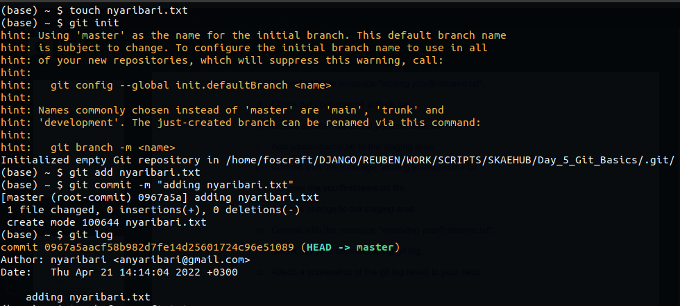
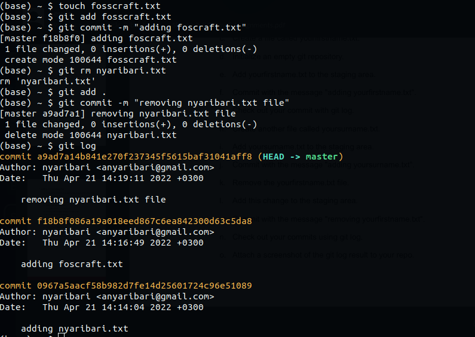

# SkaehuB Bootcamp

Assignment 5 Day 5

### Adding and committing Files

- Create a folder called Day_5_Git_Basics. (Make sure you do this from a folder
that isn't a git repository)
- cd into the Day_5_Git_Basics folder.
- Create a file called yourfirstname.txt.
- Initialize an empty git repository.
- Add yourfirstname.txt to the staging area.
- Commit with the message "adding yourfirstname.txt".
- Check out your commit with git log.
- Create another file called yoursurname.txt.
- Add yoursurname.txt to the staging area.
- Commit with the message "adding yoursurname.txt".
- Remove the yourfirstname.txt file.
- Add this change to the staging area.
- Commit with the message "removing yourfirstname.txt".
- Check out your commits using git log.
- Attach a screenshot of the git log result to your repo.

### Screenshots of the git log

**Fig 1: First commit git log screenshot**

**Fig 2: Second commit git log screenshot**

